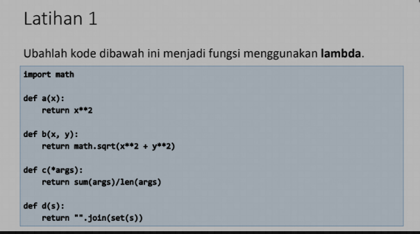
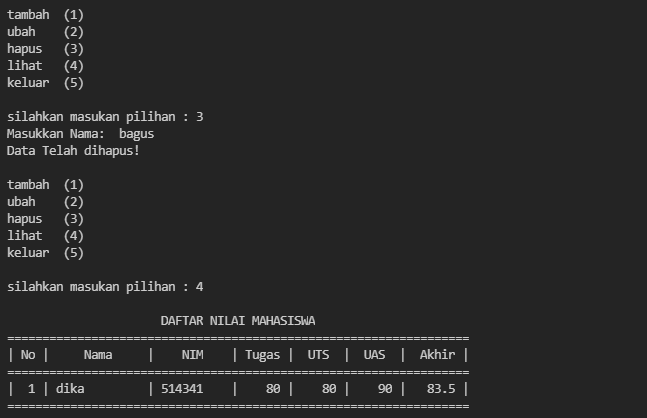

# pertemuan-11

# latihan
pada latihan 11 saya diberi soal

# jawab

    nomor 1 :

        before

        def a(x):
            return x**2
        after

        a=lambda x: (x**2)
    nomor 2 :

        before

        def b(x,y):
            return math.sqrt(x**2 + y**2)
        after

        b=lambda x,y: math.sqrt(x**2 + y**2)

    nomor 3

        before

        def c(*args):
            return sum(args)/len(args)
        after

        c=lambda *args:sum(args)/len(args)
    nomor 4:

        before

        def d(s):
            return "".join(set(s)) 
      after

        d=lambda s: "".join(set(s))      

# pratikum

pada tugas praktium saya diberi soal sebagai berikut 

# jawab

pertama saya membuat looping agar program terus berjalan

    while True:
        print('\ntambah\t(1)\nubah\t(2)\nhapus\t(3)\nlihat\t(4)\nkeluar\t(5) ')                                                                                     
        c = input("\nsilahkan masukan pilihan : ")                              

 lalu saya membuat format if untuk memasukan pilihan , sebagai contoh apabila memilih (1) akan menambah data

    if (c.lower() == '1'):                                               
            print('\nTambah Data Mahasiswa Baru')
            nama= input("Masukkan Nama\t\t: ")                                        
            nim= input("Masukkan NIM\t\t: ")                                         
            nilaiTugas= int(input("Masukkan Nilai Tugas\t: "))                              
            nilaiUts= int(input("Masukkan Nilai UTS\t: "))                                   
            nilaiUas= int(input("Masukkan Nilai UAS\t: "))                                    
            nilaiAkhir= (0.30 * nilaiTugas) + (0.35 * nilaiUts) + (0.35 * nilaiUas)              
            dataMhs[nama]= nim, nilaiTugas, nilaiUts, nilaiUas, nilaiAkhir                         
            print("\nData Berhasil Ditambahkan!")       

 saya juga melakukan percabangan if (elif) untuk melaksanakan pilihan yang lain

    elif (c.lower() == '2'):                                                                    
        print('\nMengedit Data Mahasiswa')
        nama = input("Masukkan Nama: ")                                                         
        if nama in dataMhs.keys():                              
            nim= input("Masukkan NIM Baru\t: ")                              
            nilaiTugas= int(input("Masukkan Nilai Tugas\t: "))                           
            nilaiUts= int(input("Masukkan Nilai UTS\t: "))                           
            nilaiUas= int(input("Masukkan Nilai UAS\t: "))                           
            nilaiAkhir= (0.30 * nilaiTugas) + (0.35 * nilaiUts) + (0.35 * nilaiUas)          
            dataMhs[nama] = nim, nilaiTugas, nilaiUts, nilaiUas, nilaiAkhir                      
            print("\nData Berhasil Di Update!")

dan saya juga menggunakan else untuk apabila salah memasukan pilihan inputan

        print("\nMohon maaf input salah\n\nSilahkan pilih menu yang tersedia: ")                                                                                                            

# tampilan pada visual studio code

# output

ini adalah output apabila memilih ditambah (1)
                

ini ada output apabila memilih ubah(2)
                

ini adalah output apabila memilih ditambah lagi
                

ini adalah output apabila memilih hapus(3) 
                

ini adalah output apabila memilih lihat (4) 
                

ini adalah output apabika memilih keluar (5)
                

            ======TERIMAKASIH======